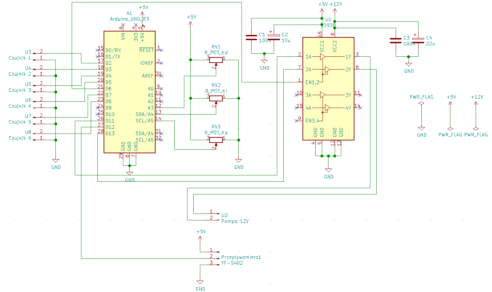

# STMars Modular Robot
>The aim of this project was to create PID controller to control the water pump.

## Table of contents
* [General info](#general-info)
* [Screenshots](#screenshots)
* [Technologies](#technologies)
* [Features](#features)
* [Status](#status)
* [Contact](#contact)

## General info
The microcontroller on the basis of 6 sensors determines the water level in te aquarium and controls the pump in such a way as to provide set amount of water in the aquarium.

## Screenshots

## Technologies
C,
Arduino IDE,
PID.

## Code Examples

## Features
Kp, Ki and Kd parametrs can be changed by changing the potentiometer settings.

## To-do list
Cover.

## Status
Maybe I`ll transfer the design to STM.

## Contact
Created by https://www.linkedin.com/in/kamil-gradowski-8706991aa - feel free to contact me!
grados73
